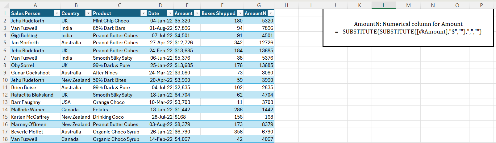
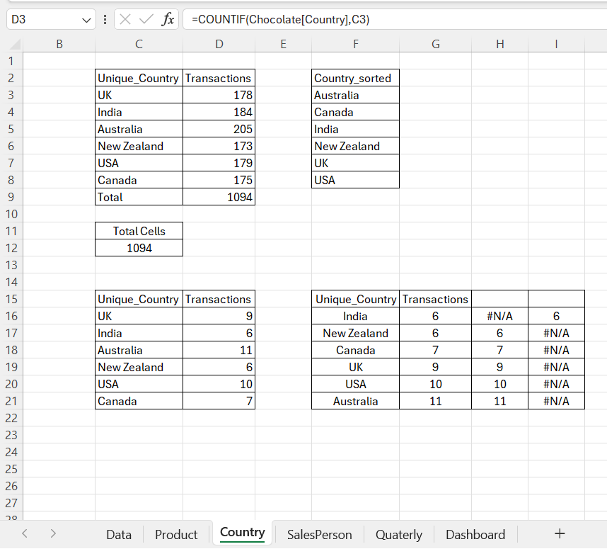

# Chocolate Sales Analysis Dashboard (Excel)

## Project Overview
This project involves analyzing chocolate sales data using Microsoft Excel to understand performance patterns across products, countries, sales personnel and time. The focus of this work was not only on visualization but on building **robust analytical logic**, handling **real-world data challenges** and designing **dynamic KPIs** that respond accurately to user selections.

The final outcome is an interactive Excel dashboard that enables performance exploration by **product and country**, while highlighting top contributors and time-based trends.

---

## Dataset Overview
The dataset contains transactional chocolate sales data with the following fields:
- Sales Person  
- Country  
- Product  
- Transaction Date  
- Amount (currency formatted)  
- Boxes Shipped  

To support numerical analysis, additional calculated columns were created from the raw data.

---

## Data Cleaning & Preparation

### Revenue Normalization
The `Amount` column was stored as text due to currency symbols and commas. To enable aggregation and calculations, a numeric revenue column (`AmountN`) was created.

**Logic Applied**
- Remove the currency symbol  
- Remove thousand separators  
- Convert the value to a numeric format  

**Formula Used**
=SUBSTITUTE(SUBSTITUTE([@Amount],"$",""),",","")

---

## Time Intelligence: Month to Quarter Conversion
The raw dataset did not include a quarter field. Quarters were derived directly from the transaction date to enable quarterly analysis.

**Conversion Logic**
- Extract the month from the date
- Divide the month number by 3
- Round up to determine the quarter
- Prefix the result with “Q”

**Formula Used**
="Q"&ROUNDUP(MONTH(A3)/3,0)

This enabled:
- Quarterly revenue aggregation
- Identification of the highest-performing sales quarter
- Time-based KPI creation without altering the raw dataset

---

## KPI Design

### KPI 1: Top Sales Person (Tie-Aware Logic)
This KPI identifies the top-performing sales person based on the **selected country and product**.

Instead of assuming a single top performer, the logic explicitly accounts for scenarios where **multiple sales persons share the highest performance**.

**Logic Applied**
- Identify the maximum transaction count
- Filter all sales persons matching that maximum value
- Concatenate names into a single readable output

**Formula Used**
=TEXTJOIN(", ", TRUE, FILTER(F3:F27, G3:G27 = MAX(G3:G27)))

This approach ensures analytical accuracy and avoids misleading results when ties occur.

---

### KPI 2: Maximum Revenue Quarter
This KPI identifies the quarter with the highest total revenue.

**Approach**
- Aggregate revenue at the quarter level
- Sort quarters by total revenue
- Select the highest-performing quarter dynamically

This provides a time-based performance perspective alongside individual and regional metrics.

---

## Country-Level Analysis
Country-wise analysis was performed to compare:
- Transaction volume
- Revenue contribution

This revealed that higher transaction volume does not always translate to higher revenue, highlighting the importance of **value-based analysis over volume-only metrics**.

---

## Product Performance Analysis
Product-level analysis included:
- Counting transactions per product
- Sorting products by performance
- Displaying top-performing products dynamically

Dynamic array functions were used to keep rankings responsive and reduce manual intervention.

---

## Dashboard Design
The Excel dashboard includes:
- Product performance bar charts
- Country-wise geographic revenue visualization
- KPI cards for:
  - Top Sales Person (tie-aware)
  - Top Revenue Quarter
- Interactive selectors for Product and Country

Charts were configured to remain fixed in position and unaffected by cell resizing to preserve layout consistency.

---

## Key Learning Outcomes
- Built tie-aware ranking logic instead of assuming single winners
- Designed KPIs that adapt dynamically to user selections
- Applied time intelligence without relying on pre-existing quarter data
- Transformed real-world formatted data into analysis-ready structures
- Strengthened analytical thinking around edge cases and fair comparisons
- Used Excel as a logic-building and decision-support tool, not just for reporting

---

## Screenshots

### Dashboard

### Raw Data

### Country-Level Analysis

### Top Sales Person Logic

### Date to Quarter Conversion

---

## Tools & Techniques Used
- Microsoft Excel
- Dynamic Array Functions
- Logical & Conditional Functions
- Time-Based Analysis
- Dashboard Design & Visualization

---

## Closing Note
This project demonstrates a structured and analytical approach to problem-solving in Excel, with emphasis on correct logic, adaptability and real-world data considerations. The focus throughout was on building solutions that remain accurate under changing conditions and edge cases, reflecting a strong analytical mindset.
